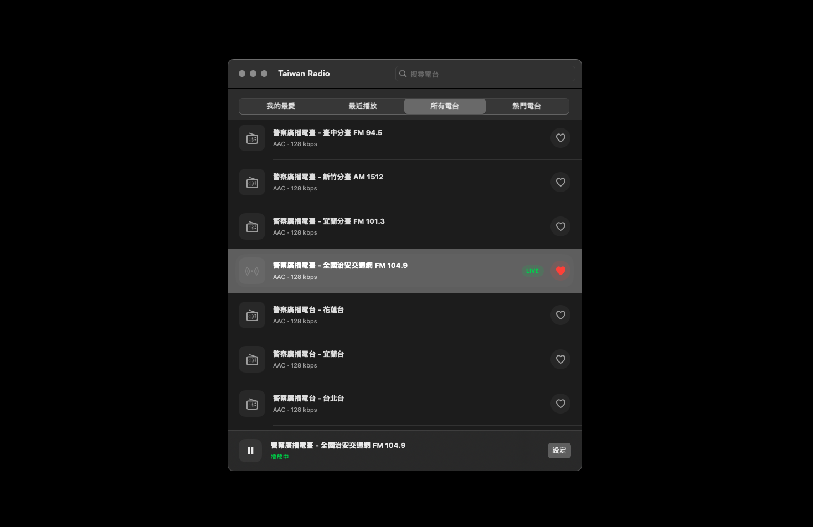

# Taiwan Radio

macOS 廣播播放器，專門抓台灣電台清單並直接播放串流。



## 支援功能

- 台灣電台清單載入
- 電台搜尋
- 我的最愛
- 最近播放
- 熱門電台
- 每日定時播放
- 每日定時停止播放

資料來源使用 [Radio Browser](https://www.radio-browser.info/) API

## 開發環境

- macOS 15.5+
- Xcode 16+
- Swift 6

專案目前沒有額外第三方套件依賴，clone 下來就能開。

## 執行方式

用 Xcode：

1. 開啟 `Taiwan Radio.xcodeproj`
2. 選 `Taiwan Radio` scheme
3. 直接 Run

用指令列：

```bash
xcodebuild \
  -project "Taiwan Radio.xcodeproj" \
  -scheme "Taiwan Radio" \
  -destination "platform=macOS" \
  build
```

## 測試

```bash
xcodebuild \
  test \
  -project "Taiwan Radio.xcodeproj" \
  -scheme "Taiwan Radio" \
  -destination "platform=macOS" \
  -derivedDataPath ".derived-data/test"
```

## 本機安裝

repo 內有一支安裝腳本，會：

- 用 `Release` 組態 build app
- 關閉正在執行的 `Taiwan Radio`
- 複製 `.app` 到 `/Applications`

指令：

```bash
./scripts/install_local.sh
```

## 專案結構

```text
Taiwan Radio/
├── Taiwan Radio/
│   ├── Taiwan_RadioApp.swift
│   ├── ContentView.swift
│   ├── ContentViewComponents.swift
│   ├── StationRow.swift
│   ├── SettingsView.swift
│   ├── RadioViewModel.swift
│   ├── RadioModels.swift
│   ├── StationService.swift
│   ├── PlayerService.swift
│   ├── ScheduleService.swift
│   └── LibraryStore.swift
├── Taiwan RadioTests/
├── Taiwan RadioUITests/
└── scripts/
```

## License

MIT License
